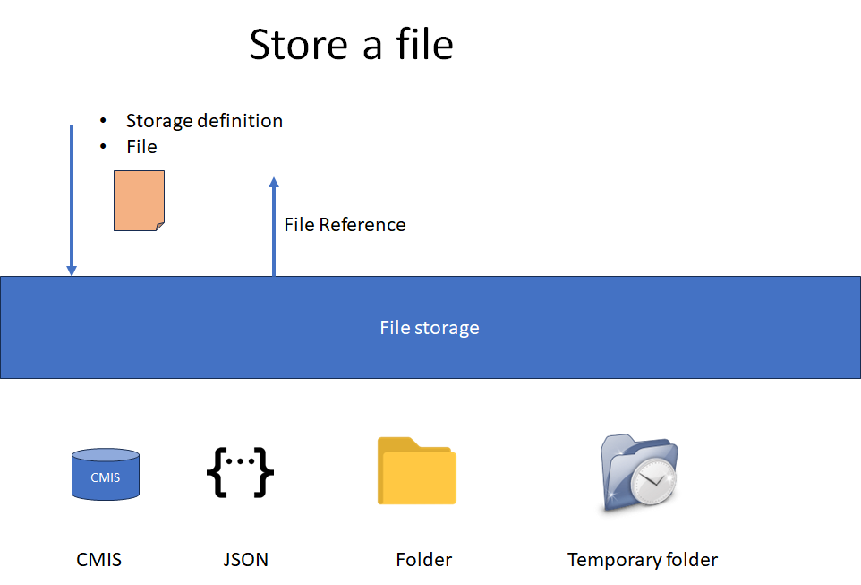
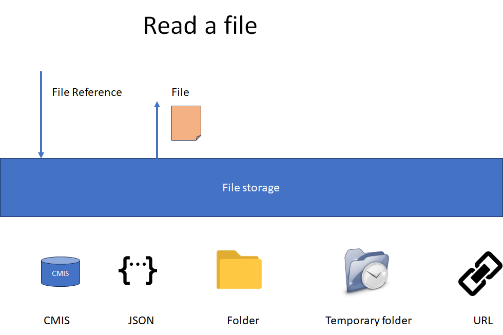
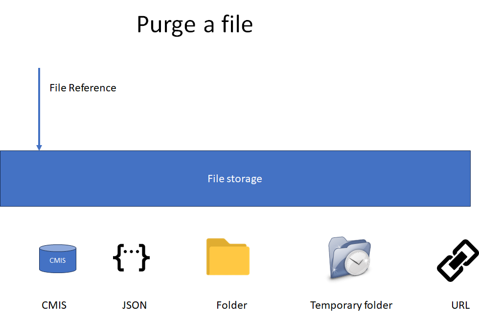

# zebee-filestorage
[](https://github.com/camunda-community-hub/community)


Library to manipulate File process variables and store the content in different storage (Folder, CMIS...)

This library is used by connectors or by an application.

# Principle
Zeebe can't manipulate the files, only String as a process variable.

The idea is to give to the File Storage the file and get back a **File Reference**.
The **File Reference** can be saved as a process variable.

## Store a file

Multiple storage are available: to specify which file storage is used, a **Storage Definition** is provided.


Multiple storages are available (see the section below).

* CMIS: Any Content Management Interoperability Services. A lot of tools exist.
* JSON: the file is saved directly in the file reference. Zeebe allows only 4 Mb for the payload; this method works only for small files.
* Folder: a folder on the host. Specify a shared folder in the cluster
* Temporary Folder: the temporary folder of the host is used (assuming all applications/connectors/workers run on the same host)


## Read a file
With the *File Reference**, it is possible to retrieve the file



Note: The storage "URL" can be used to read a file from a URL. It is a Read Only storage.


## Purge a file
The file can be purged from the storage when the process is finished. The **File Reference** is provided.

There is no "expiration mechanism" (except the temporary folder, which is purged on each reboot), so the application must purge files.



# API

The API contains three main access.

## Store files

Get an instance of the factory.

````java
  FileRepoFactory fileRepoFactory = FileRepoFactory.getInstance();
````

Create a **FileVariable**. Upload the file in the **FileVariable** object.

````java
FileVariable fileVariable = new FileVariable();
byte[] contentInByte = <Content In Byte>
fileVariable.setValue( contentInByte );
fileVariable.setName( "MyDocumentName.pdf");
fileVariable.setMimeType( FileVariable.getMimeTypeFromName(fileVariable.getName()));
`````

Set the **Storage Definition**. The **Storage Definition** describes where the core document is stored.


````java
    StorageDefinition storageDefinition = StorageDefinition.getFromString(storageDefinitionSt);
    
    fileVariable.setStorageDefinition(storageDefinition);
````

See below the different Storage definitions available, and the structure of the storageDefinitionSt.


Save the **File Variable**. The function returns a **FileVariableReference**.


````java
    FileVariableReference fileVariableReference = fileRepoFactory.saveFileVariable(fileVariableValue);
````

The fileVariableReference is only a reference and can be saved in the process variable.

````java
    String processVariableSt = fileVariableReference.toJson();
    // save the processVariableSt as a process variable
````

## Read a file

Access the file from the **FileVariableReference**.

````java
    String processVariableSt = <GetFromProcessVariable>
    FileVariableReference fileVariableReference = FileVariableReference.fromJson( processVariableSt );
````

Then, get the **FileVariable** from the repository.

````java
  FileRepoFactory fileRepoFactory = FileRepoFactory.getInstance();
  FileVariable fileVariable = fileRepoFactory.loadFileVariable(fileVariableReference);
````

Content, fileName, and MimeType are available via the method.

The **Storage Definition** information is saved in the **FileVariable** to update it, change the content, and store it again.

## Purge a file

From the **FileVariableReference**, purging the document in the storage is possible.

````java
    String processVariableSt = <GetFromProcessVariable>
    FileVariableReference fileVariableReference = FileVariableReference.fromJson( processVariableSt );

    FileRepoFactory fileRepoFactory = FileRepoFactory.getInstance();
    boolean filePurged = fileRepoFactory.purgeFileVariable(fileVariableReference);
````

# Storage definition
Different *Storage Definition** are available. The storage stores the core of the document.

## JSON

The file is saved in JSON, and the **FileVariableReference** contains the complete document. 
It is very efficient, but Zeebe limited the size of the process to 4 Mb. 
This solution does not make it possible to save documents (Word, OpenOffice, PDF) which are in general bigger.

Storage Definition Key: "JSON"

````java
import StorageJSON;

String storageDefinition = StorageJSON.getStorageDefinitionString();
````


## Temporary folder

The file is saved in the Temporary folder of the host.
If multiple applications (different connectors) need to access the file, this is not an acceptable document, except if all applications are hosted by the same machine (or the same Pod)

Storage Definition Key: "TEMPFOLDER"

````java
import StorageTempFolder;

String storageDefinition = StorageTempFolder.getStorageDefinitionString();
````

## Folder
The file is saved in the folder given in the connection string.
If multiple applications need to access the file, the folder must be visible and shared in the same place (/mnt/file storage" for example).

Storage Definition Key: "FOLDER:/this/is/the/path/to/the/storage"


````java
import StorageFolder;

String storageDefinition = StorageFolder.getStorageDefinitionString(String folder);
````


## CMIS

The file is saved in a CMIS tool. The connection to the tool (URL, Repository name, username, password) must be provided.
The folder where the file must be stored must be provided, too.

Storage Definition Key: "CMIS:{"url":"<url>", "repositoryName":"<repositoryName>", "userName": "<userName>", "password": "<password>", "storageDefinitionFolder":"<folder>"}"

The static method is available in the StorageCMIS class.

````java
import StorageCMIS;

String storageDefinition = StorageCMIS.getStorageDefinitionString(String url, String repositoryName, String userName, String password, String storageDefinitionFolder)
````

## URL
The file may be accessed via a URL. This storage is used to READ only.

For example, this source file reads a document from a URL.
````java
import StorageURL;

String storageDefinition = StorageURL.getStorageDefinitionString("https://github.com/camunda-community-hub/camunda-8-connector-officetopdf/raw/main/src/test/resources/OfficeToPdfExample.docx");
````

## Get from a String

This method return a Storage definition from a String

````java
import StorageDefinition;

StorageDefinition storageDefinition  = StorageDefinition.getFromString( storageDefinitionSt );

````

The format of the string is the following:
<Type>:<Complement>

Types are **JSON**, **TEMPFOLDER**, **FOLDER**, **CMIS**, **URL**

Complement depends of the type.

**JSON**, **TEMPFOLDER**, **URL** does not have any complement.

**CMIS** contains as reference the access information, saved in JSON, for example
````
"CMIS:{\"url\":\"http://localhost:8099/lightweightcmis/browser\",\"userName\":\"cmisaccess\",\"password\":\"demo\",\"storageDefinitionFolder\":\"/storagecmis\"}"
````


*FOLDER* needs to describe the folder
````
"FOLDER:/this/is/the/path/to/the/storage"
````

From a *StorageDefinition*, the string can be get:

`````java
String storageDefinitionSt = storageDefinition.encodeToString()
`````
